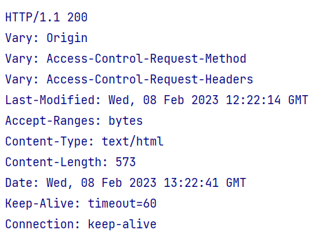
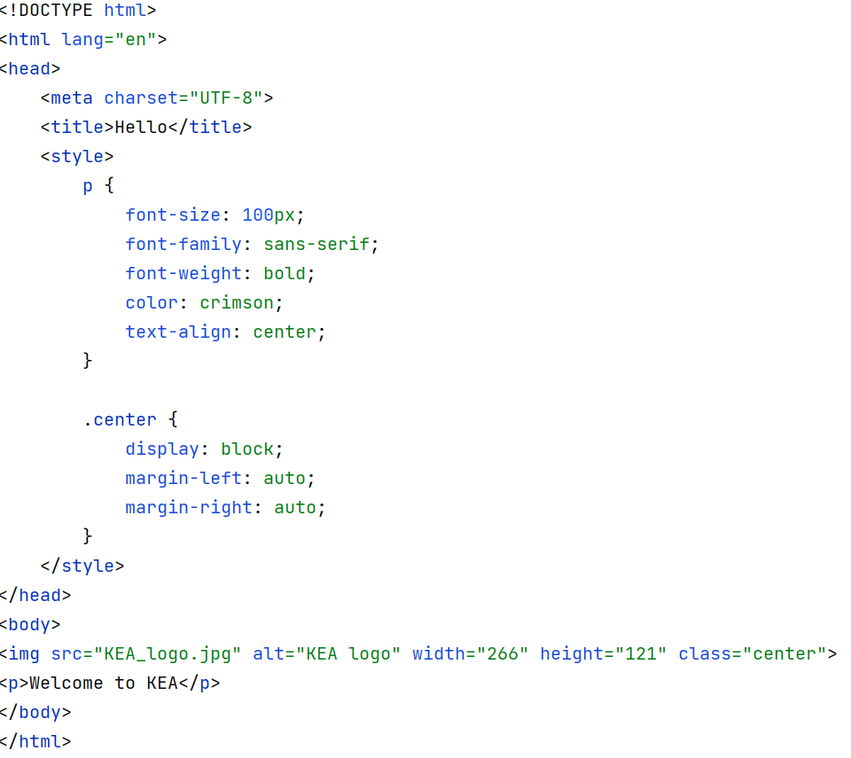

# Undervisningsnote

# Netværk
Det centrale du skal kende til for at kunne forstå netværksprogrammering er:

- IP-adresser - computerens “telefonnummer” på internettet
- Port-numre - hvilket program på computeren ønsker man at tale med
- Protokol - hvordan vi skal snakke, når der er oprettet forbindelse

## Internettets opbygning
Når man skriver en URL i browseren og får svar tilbage fra serveren kommer alle dele i brug.

En HTTP URL ser ud på denne måde: http://ipaddress:port/path?query.

### IP-adresse
Der er to forskellige måder måder at angive en IP adresse. 
Dels kan man angive selve IP adressen. Det er fire tal mellem 0 og 255. Et eksempel kunne være DR's hjemmeside som har 159.20.6.38, 
eller Facebook der har 31.13.64.35.

Som bekendt behøver man ikke at skrive http://159.20.6.38, 
hvis man vil se DR's hjemmeside. 
Din computer benytter sig af nogle specielle computere, der er på nettet der hedder “DNS” (Domain Name System). 
En DNS er en computer på nettet, som har en tabel over hvilken IP adresse, der hører til hvilket navn. Din browser har indbygget en række velkendte DNS (Google har f.eks. en DNS på 8.8.8.8).

Ved hjælp af en IP adresse kan du få fat i en anden computer på internettet.

## Server, Port
Normalt beder vi vores browser om at hente en HTML side på en server (ud fra dens IP addresse). Hvis man ikke skriver noget specielt, vil browseren henvende sig på port 80, som er standardporten for en web server. 
Men vi kan bede servere om meget andet end HTML sider. 
Vi kan bede en mail server om at levere os emails, vi kan bede en mail server om at sende emails, vi kan bede om skærmdeling osv.

<p>Når vi prøver at få fat i en server, skal der være et program på denne server, der er parat til at håndtere henvendelsen. 
For at serveren kan håndtere mere end en type af henvendelser, er der flere programmer der kan køre samtidigt, og de får hver sit portnummer. 
En webserver lytter ofte på port 80, men man kan bruge et vilkårligt portnummer. 
Der er visse begrænsninger på portnumre under 1024 da de er 

[reserveret til diverse standarder](https://en.wikipedia.org/wiki/List_of_TCP_and_UDP_port_numbers)
<p>Bemærk - man kan godt have klient og server på samme maskine. Der er et særligt navn der hedder localhost (som har IP nummer 127.0.0.1).</p>

### Klient og Server
I eksemplerne ovenfor er det en browser der snakker med en webserver. 
Serveren er den der har et program der sidder og venter på, at der kommer en henvendelse. Klienten er det program der henvender sig.

# HTTP
HTTP er en protokol som bruges mellem en browser (klienten) og en webserver.

Generelt beskriver en protokol hvad serveren regner med at klienten skriver til serveren, og hvad klienten kan forvente at serveren svarer.

Hvis vi i IntelliJ lokalt på egen maskine starter en Tomcat webserver, 
kan vi fra en browser skrive http://localhost:8080/welcome.html, hvorefter server-programmet sender flg. svar til browseren (HTTP Response): 
- En statuskode 200, som betyder alt er gået OK
- Header informationer, f.eks. 
  - at resourcen, som serveren sender til browseren er i tekst (HTML) format  
  - at der kommunikeres over HTTP version 1. (Der findes også en version 2)



- Selve HTML siden sendes som såkaldt body del af HTTP Response:



<!-- ## Http Request
I den kode vi bruger i denne uge er der en særlig Java klasse der hedder HttpRequest der kan bruges i serveren til at læse en forespørgsel og pille header, path, parametre osv. ud af den tekst som browseren sender.

Der er lavet mange klasser til Java der kan hjælpe med at håndtere http request beskeder fra klienter. Senere når vi går over til at bruge tomcat serveren, så vil vi bruge en der hedder HttpServletRequest.
--> 
## HTTP Response 
I den kode vi bruger i denne uge er der en særlig Java klasse i Spring Frameworket der hedder ```ResponseEntity```.
Den skal vi  bruge til at manipulere webserverens HTTP Response, dvs. dét svar serveren sender tilbage til browseren.

```ResponseEntity```repræsenterer et HTTP Response, inklusiv headers, body og status. 
I Spring findes også ```@ResponseBody```, som man kan annotere sin HTTP request handler metode med. 
Forskellen er at den placerer retursvaret fra serveren *inde* i response body, hvorimod ```ResponseEntity``` tillader os at tilføje header og statuskode.

```@Controller
public class SimpleController {

  @GetMapping("welcome")
  public ResponseEntity<String> sayWelcome() {
    return new ResponseEntity<>("Welcome to KEA", HttpStatus.OK);
  }
  
  @GetMapping("welcome2")
  @ResponseBody
  public String sayWelcome2() {
    return "welcome to KEA";
  }
} 
```
